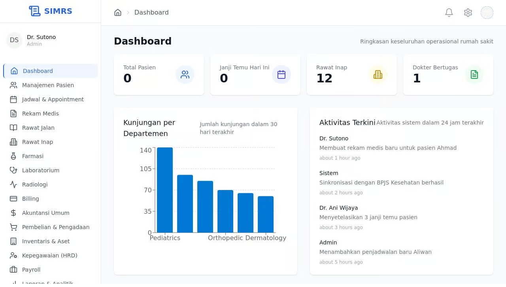
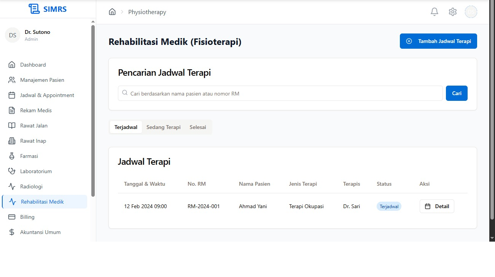
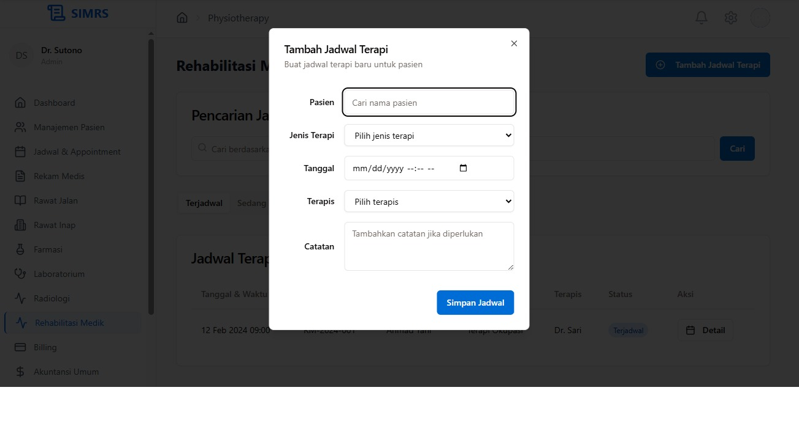

# SIMRS (Sistem Informasi Manajemen Rumah Sakit)

Proyek ini adalah aplikasi Sistem Informasi Manajemen Rumah Sakit (SIMRS) yang dibangun menggunakan teknologi modern seperti React, Vite, dan TailwindCSS. Aplikasi ini mencakup berbagai modul untuk mengelola data pasien, janji temu, rekam medis, farmasi, laboratorium, radiologi, keuangan, dan sumber daya manusia.





## Fitur Utama

- **Manajemen Pasien**: Pendaftaran, pengelolaan data pasien, dan rekam medis.
- **Janji Temu**: Penjadwalan dan pengelolaan janji temu pasien.
- **Farmasi**: Pengelolaan obat-obatan dan resep.
- **Laboratorium & Radiologi**: Pengelolaan hasil tes laboratorium dan radiologi.
- **Keuangan**: Modul untuk billing, akuntansi, dan pengadaan.
- **Sumber Daya Manusia**: Pengelolaan data karyawan dan penggajian.
- **Integrasi Sistem**: Dukungan untuk integrasi dengan sistem lain.

## Struktur Proyek

```
.config/
client/
  src/
    components/
    context/
    pages/
    App.tsx
server/
  index.ts
  routes.ts
  vite.ts
shared/
  schema.ts
tailwind.config.ts
vite.config.ts
```

- **`client/`**: Berisi kode frontend aplikasi.
- **`server/`**: Berisi kode backend untuk API dan konfigurasi server.
- **`shared/`**: Berisi skema data yang digunakan bersama antara frontend dan backend.

## Teknologi yang Digunakan

- **Frontend**: React, TailwindCSS, Wouter
- **Backend**: Express.js
- **Build Tools**: Vite
- **State Management**: React Query
- **Validasi**: Zod
- **Database**: (Tambahkan jika ada)

## Instalasi

1. Clone repositori ini:
   ```bash
   git clone <repository-url>
   cd <repository-folder>
   ```

2. Install dependencies:
   ```bash
   npm install
   ```

3. Jalankan aplikasi:
   ```bash
   npm run dev
   ```

4. Akses aplikasi di browser pada `http://localhost:3000`.

## Skrip NPM

- `npm run dev`: Menjalankan aplikasi dalam mode pengembangan.
- `npm run build`: Membuat build produksi.
- `npm run start`: Menjalankan server produksi.

## Konfigurasi

- **Vite**: Konfigurasi Vite dapat ditemukan di vite.config.ts.
- **TailwindCSS**: Konfigurasi TailwindCSS dapat ditemukan di tailwind.config.ts.

## Kontribusi

1. Fork repositori ini.
2. Buat branch fitur baru:
   ```bash
   git checkout -b fitur-baru
   ```
3. Commit perubahan Anda:
   ```bash
   git commit -m "Menambahkan fitur baru"
   ```
4. Push ke branch Anda:
   ```bash
   git push origin fitur-baru
   ```
5. Buat Pull Request.

## Lisensi

Proyek ini dilisensikan di bawah MIT License.

## Kontak

Untuk pertanyaan atau saran, silakan hubungi [habizinnia@gmail.com]